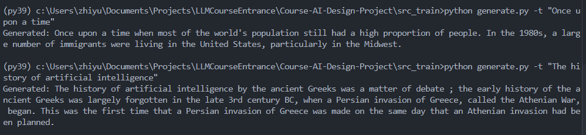
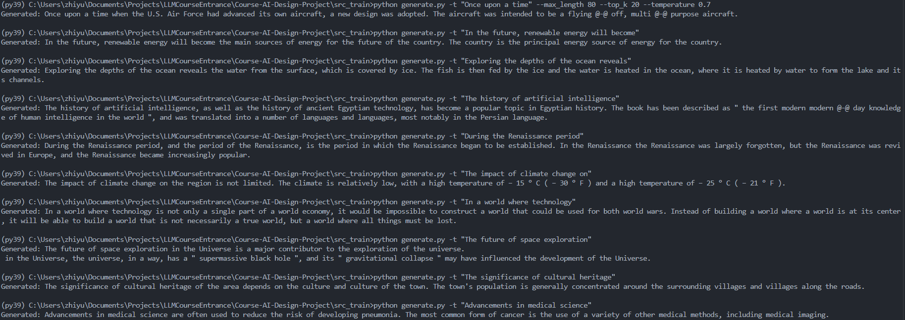

# Course-AI-Design-Project

## Table of Contents
- [Overview](#overview)
- [Group Members](#group-members)
- [Dataset Description](#dataset-description)
- [Problem Statement](#problem-statement)
- [Project Structure](#project-structure)
- [Environment Setup](#environment-setup)
- [Model Architecture](#model-architecture)
- [Training Process](#training-process)
- [Results](#results)
- [Generated Text Samples](#generated-text-samples)
- [Usage](#usage)
- [References](#references)

## Overview

This project involves training a language model for the AI-Design Course (SME637003.01) at Fudan University. The purpose of this project is to develop a model capable of generating coherent and unambiguous sentences.

### Group Members:
|  Name  | Student Number |
| :----: | :------------: |
| 郑志宇 |  24112020118   |
|  汤政  |  24212020169   |

### Brief Introduction
The project aims to train a language model using a selected dataset to address specific problem statements and achieve high-level objectives.

### Dataset Description
The dataset used for training is the Wikitext-103 dataset, which provides a large corpus of text for language modeling tasks.

### Problem Statement
Develop a language model that can generate coherent and meaningful sentences based on the training data.

### High-Level Objectives
- Successfully train a language model with stable, low loss values.

  Generate diverse, coherent, and unambiguous sentences based on various input prompts.

## Project Structure
Overview of the directory and file structure:
- `generate.py`: Code for generating text using the trained model.
- `train.py`: Script for model training.
- `requirements.txt`: List of dependencies.
- `README.md`: Project documentation.
- Any other relevant files.

## Environment Setup
### Instructions for Setting Up the Environment
1. Ensure you have Python installed.
2. Install the required dependencies listed in `requirements.txt`.

### Steps to Install Dependencies
```bash
pip install -r requirements.txt
```

Remember to download the torch with cuda if you have GPU.

### Hardware Requirements
- A GPU with at least 8GB memory is recommended for faster training.

## Model Architecture
### Description
The model architecture used is GPT-2, a transformer-based language model designed for unsupervised multitask learning. GPT-2 can perform various language tasks, such as translation, summarization, and question answering, without explicit task-specific fine-tuning.

### Key Modifications
- **Custom Tokenizer Settings**: Adapted to align more closely with the Wikitext-103 dataset vocabulary, optimizing for common words and phrases found within this corpus.

  **Optimized Training Loop**: Modifications in the training loop for improved memory management and efficient loss calculation, allowing for faster convergence and reduced computational requirements.

### Detail

**Architecture**: GPT-2 is a transformer model with a decoder-only architecture, consisting of multiple layers of self-attention and feed-forward networks. It has been scaled to various parameter sizes (from 117M to 1.5B) to achieve higher performance on language modeling tasks. Positional encodings are used to retain the order of words in each sequence.

**Training Corpus (WebText vs. Wikitext)**: GPT-2 was originally trained on WebText, a curated dataset of high-quality web pages, which captures a broad range of conversational and factual content. In this project, we use the Wikitext-103 dataset, a similarly high-quality dataset that provides a large corpus of English text specifically designed for language modeling.

**Byte-Pair Encoding (BPE)**: The model uses Byte-Pair Encoding (BPE) for tokenization, segmenting text into subwords to allow for a flexible and comprehensive vocabulary. This enables the model to handle both common and rare words effectively, ensuring high-quality text generation across different contexts.

**Zero-Shot Learning Capability**: GPT-2’s architecture enables it to handle a wide range of NLP tasks without fine-tuning. By conditioning on context, the model can perform tasks like summarization and answering factual questions with minimal prompts, leveraging its training on diverse text data.

**Training Optimization**: GPT-2 uses the Adam optimizer with a cosine learning rate schedule and warmup phase, which helps stabilize training and improves convergence speed. Techniques such as weight decay and gradient clipping are applied to prevent overfitting and control gradient explosion.

## Training Process
### Description
The training process involves several steps:
- **Data Preprocessing**: Tokenizing and encoding the text data.
- **Training Parameters**: Learning rate, batch size, and number of epochs.
- **Augmentation Techniques**: None applied.
- **Regularization Methods**: Weight decay.

### Training Code
The training code is located in `src_train/train.py`.

## Results
### Training Results
The training of the GPT-2 model was successful, as shown in the loss curve below. The loss decreased consistently over time, stabilizing around a lower value, indicating the model's improved performance as it learned from the data.


Initial Loss: 6.972
Final Loss: 2.978
Total Steps: Approximately280k
Training Duration: Approximately 15.4 hours

### Generated Text Samples
Below are some text samples generated by the trained model. These examples showcase the model's ability to generate coherent and contextually relevant text based on the input provided.

#### Example 1

- Input Prompt: "Once upon a time" 
- Generated Text: "Once upon a time when most of the world's population still had a high proportion of people. In the 1980s, a large number of immigrants were living in the United States, particularly in the Midwest."

#### Example 2

- Input Prompt: "In the future, renewable energy will become" 
- Generated Text: "In the future, renewable energy will become the main sources of energy for the future of the country. The country is the principal energy source of energy for the country."

#### Example 3

- Input Prompt: "Exploring the depths of the ocean reveals" 
- Generated Text: "Exploring the depths of the ocean reveals the water from the surface, which is covered by ice. The fish is then fed by the ice and the water is heated in the ocean, where it is heated by water to form the lake and its channels."

#### Example 4

- Input Prompt: "The history of artificial intelligence"
- Generated Text: "The history of artificial intelligence by the ancient Greeks was a matter of debate ; the early history of the ancient Greeks was largely forgotten in the late 3rd century BC, when a Persian invasion of Greece, called the Athenian War, began. This was the first time that a Persian invasion of Greece was made on the same day that an Athenian invasion had been planned."

#### Example 5

- Input Prompt: "During the Renaissance period"
- Generated Text: "During the Renaissance period, and the period of the Renaissance, is the period in which the Renaissance began to be established. In the Renaissance the Renaissance was largely forgotten, but the Renaissance was revived in Europe, and the Renaissance became increasingly popular."

#### Example 6

- Input Prompt: "The impact of climate change on"
- Generated Text: "The impact of climate change on the region is not limited. The climate is relatively low, with a high temperature of − 15 ° C ( − 30 ° F ) and a high temperature of − 25 ° C ( − 21 ° F )."

#### Example 7

- Input Prompt: "In a world where technology"
- Generated Text: "In a world where technology is not only a single part of a world economy, it would be impossible to construct a world that could be used for both world wars. Instead of building a world where a world is at its center, it will be able to build a world that is not necessarily a true world, but a world where all things must be lost."

#### Example 8

- Input Prompt: "The future of space exploration"
- Generated Text: "The future of space exploration in the Universe is a major contributor to the exploration of the universe. 
 in the Universe, the universe, in a way, has a " supermassive black hole ", and its " gravitational collapse " may have influenced the development of the Universe."

#### Example 9

- Input Prompt: "The significance of cultural heritage"
- Generated Text: "The significance of cultural heritage of the area depends on the culture and culture of the town. The town's population is generally concentrated around the surrounding villages and villages along the roads."

#### Example 10

- Input Prompt: "Advancements in medical science"
- Generated Text: "Advancements in medical science are often used to reduce the risk of developing pneumonia. The most common form of cancer is the use of a variety of other medical methods, including medical imaging."

Here is the picture of our test.





## Usage
### Instructions for Running the Model Inference
To generate text using the trained model, run the following command:
```bash
cd src_train
python generate.py -t "Your input text here" --max_length 80 --top_k 20 --temperature 0.7
```

### Example Usage
```bash
cd src_train
python generate.py -t "Once upon a time" --max_length 80 --top_k 20 --temperature 0.7
```

## References
- [GPT-2 Paper](https://cdn.openai.com/better-language-models/language_models_are_unsupervised_multitask_learners.pdf)
- [Transformers Documentation](https://huggingface.co/transformers/)
